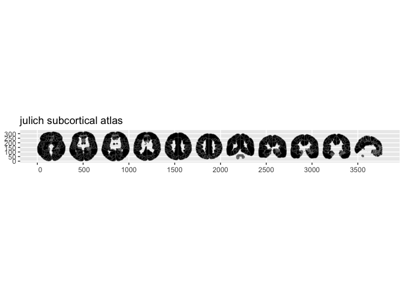

<!-- README.md is generated from README.Rmd. Please edit that file -->

# ggsegJulich

<!-- badges: start -->

[](https://github.com/ggsegverse/ggsegJulich/actions/workflows/R-CMD-check.yaml)
[](https://ggsegverse.r-universe.dev/ggsegJulich)
<!-- badges: end -->

Julich-Brain Cytoarchitectonic Atlas for the ggsegverse Ecosystem.

## Installation

``` r
# From r-universe
install.packages("ggsegJulich", repos = "https://ggsegverse.r-universe.dev")

# From GitHub
# install.packages("remotes")
remotes::install_github("ggsegverse/ggsegJulich")
```

## Atlases

### julich

Julich-Brain cytoarchitectonic atlas with 294 regions, created from 4D
probability maps.

``` r
library(ggsegJulich)
plot(julich())
```

 

## Data source

[EBRAINS Knowledge
Graph](https://search.kg.ebrains.eu/instances/ab191c17-8cd8-4622-aaac-eee11b2fa670).

- **Reference**: Amunts et al. (2020)
  [doi:10.1126/science.abb4588](https://doi.org/10.1126/science.abb4588)

- **Date obtained**: 2026-03-28
